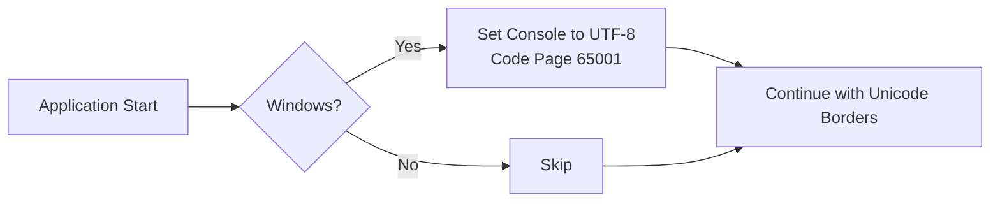

# Fix Border Rendering for Command Blocks

## Problem Analysis

The command block borders in the terminal UI are showing as broken/scattered pipe characters (`|`) instead of proper Unicode box-drawing characters. This is caused by:

1. **Windows Console Encoding**: Windows cmd.exe uses legacy code pages (like CP437 or CP1252) by default instead of UTF-8
2. **Missing UTF-8 Configuration**: The application doesn't set UTF-8 encoding on startup

## Current Implementation

The borders are defined in [`main.go`](main.go:41-45) using `lipgloss.RoundedBorder()`:

```go
cmdBlockStyle = lipgloss.NewStyle().
    Border(lipgloss.RoundedBorder()).
    BorderForeground(themeBorder).
    Padding(0, 1).
    Margin(0, 1, 1, 1)

inputContainerStyle = lipgloss.NewStyle().
    Border(lipgloss.RoundedBorder()).
    BorderForeground(themeAccent).
    Padding(0, 1)
```

`lipgloss.RoundedBorder()` uses these Unicode characters:
- Corners: `╭`, `╮`, `╰`, `╯`
- Horizontal: `─`
- Vertical: `│`

## Solution: Force UTF-8 Encoding

The simplest and most reliable solution is to configure the Windows console to use UTF-8 encoding (code page 65001) at application startup.



## Implementation Plan

### Step 1: Add Windows UTF-8 Setup Function

Add a function to configure Windows console for UTF-8:

```go
import (
    "os"
    "runtime"
    "syscall"
)

// setupConsole sets up the console for proper Unicode output on Windows
func setupConsole() {
    if runtime.GOOS == "windows" {
        // Get the stdout handle
        stdout := syscall.Handle(os.Stdout.Fd())
        
        // Set console output mode to enable UTF-8
        const ENABLE_VIRTUAL_TERMINAL_PROCESSING = 0x0004
        var mode uint32
        syscall.GetConsoleMode(stdout, &mode)
        mode |= ENABLE_VIRTUAL_TERMINAL_PROCESSING
        syscall.SetConsoleMode(stdout, mode)
        
        // Set console output code page to UTF-8
        syscall.SetConsoleOutputCP(65001)
        syscall.SetConsoleCP(65001)
    }
}
```

### Step 2: Call Setup in main Function

Modify the `main()` function to call `setupConsole()` before creating the Bubble Tea program:

```go
func main() {
    setupConsole() // Add this line
    
    p := tea.NewProgram(
        InitialModel(),
        tea.WithAltScreen(),
        tea.WithMouseCellMotion(),
    )

    if _, err := p.Run(); err != nil {
        fmt.Printf("Error: %v", err)
    }
}
```

### Alternative: Using golang.org/x/sys/windows

For a more robust solution using the extended Windows API:

```go
import (
    "golang.org/x/sys/windows"
)

func setupConsole() {
    if runtime.GOOS == "windows" {
        windows.SetConsoleOutputCP(windows.CP_UTF8)
        windows.SetConsoleCP(windows.CP_UTF8)
    }
}
```

## Files to Modify

| File | Changes |
|------|---------|
| [`main.go`](main.go) | Add `setupConsole()` function, call it in `main()` |

## Required Imports

Add these imports to [`main.go`](main.go):
- `os` (already present)
- `runtime` (already present)
- `syscall` (new)

## Testing Checklist

- [ ] Test on Windows Terminal (should show Unicode borders)
- [ ] Test on Windows cmd.exe (should show Unicode borders after fix)
- [ ] Test on VS Code terminal (should show Unicode borders)
- [ ] Test on Unix/Linux terminal (should be unchanged)
- [ ] Test on macOS Terminal.app (should be unchanged)
